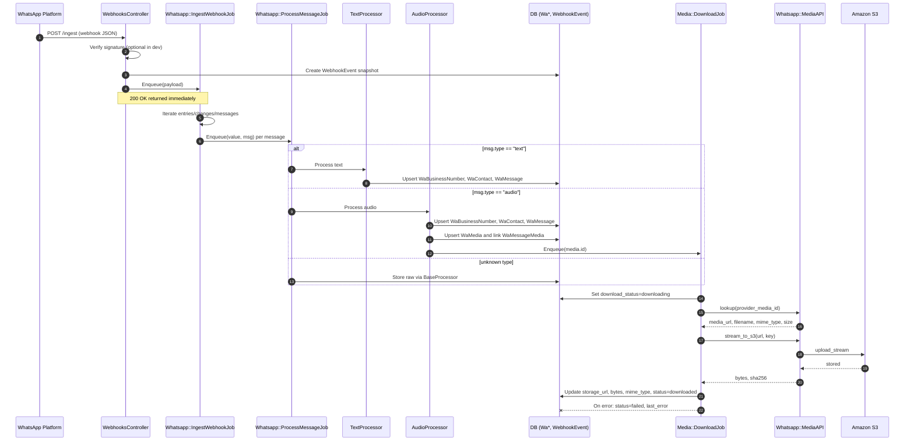

# Execution Path: WhatsApp Webhook Ingestion

This Rails API ingests WhatsApp Business Platform webhooks, persists normalized records, and (for media) downloads files to S3. Below is the end‑to‑end execution path for the main inbound message flow.

## 1) Webhook Entry Point
- Route: `POST /ingest` → `WebhooksController#create`
- Steps:
  - Optional signature check via `X-Hub-Signature-256` with `ENV['WHATSAPP_APP_SECRET']`.
  - Parse JSON payload; persist a `WebhookEvent` snapshot.
  - Enqueue `Whatsapp::IngestWebhookJob` with the parsed payload; respond `200 OK`.

Example:
```bash
curl -X POST http://localhost:3000/ingest \
  -H "Content-Type: application/json" \
  -d '{"object":"whatsapp_business_account","entry":[{"changes":[{"value":{"messaging_product":"whatsapp","messages":[{"id":"wamid...","type":"text","text":{"body":"Hello"}}],"metadata":{"phone_number_id":"106...","display_phone_number":"1555..."}}]}]}]}'
```

## 2) Ingestion Fan‑out
- `Whatsapp::IngestWebhookJob` iterates `entry[].changes[]` and, for each WhatsApp `value`, enqueues one `Whatsapp::ProcessMessageJob` per item in `value["messages"]`.

## 3) Message Processing
- `Whatsapp::ProcessMessageJob` selects a processor by `msg['type']`:
  - `TextProcessor`: upserts `WaBusinessNumber`, `WaContact`, and `WaMessage` (type `text`, no media); sets `body_text`.
  - `AudioProcessor`: upserts message (type `audio`), creates/links `WaMedia`, upserts optional `WaReferral`, then enqueues `Media::DownloadJob`.
  - Fallback to `BaseProcessor` for unknown types (stores raw for analysis).
- Upsert helpers live in `Whatsapp::Upserters`.

## 4) Media Download (async)
- `Media::DownloadJob` (queue `:media`) for each `WaMedia`:
  - Skip if already `downloaded`; otherwise mark `downloading`.
  - `Whatsapp::MediaAPI.lookup` fetches a short‑lived URL + metadata from Graph API.
  - Build S3 key: `wa/<sha256><ext>` using `extension_for(mime_type)`.
  - `Whatsapp::MediaAPI.stream_to_s3` streams the URL into S3 and returns byte count/checksum.
  - Update `WaMedia` with `storage_url`, `bytes`, `mime_type`, and mark `downloaded`; on error, mark `failed` and surface the exception.

## 5) Verification Endpoint (setup)
- Route: `GET /ingest` → `WebhooksController#verify` returns the `hub.challenge` when `hub.mode=subscribe` and `hub.verify_token` matches `ENV['WHATSAPP_VERIFY_TOKEN']`.

Jobs run via Active Job (Sidekiq recommended). See `app/jobs/**`, `app/services/whatsapp/**`, and models under `app/models/**` for implementation details.

## Sequence Diagram

